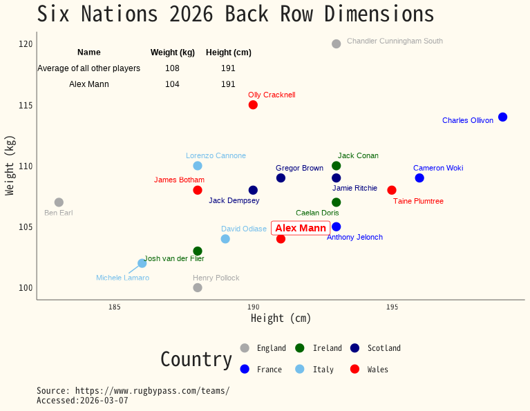

#### 1. R code

```{r}
# | echo: true
# | eval: false
# | warning: false
# | message: false
if(!(require(tidyverse))){install.packages("tidyverse");library(tidyverse)}
if(!(require(ggrepel))){install.packages("ggrepel");library(ggrepel)}
if(!require(CustomGGPlot2Theme)){devtools::install("CustomGGPlot2Theme"); library(CustomGGPlot2Theme)}
if(!(require(cowplot))){install.packages("cowplot");library(cowplot)}
if(!(require(gridExtra))){install.packages("gridExtra");library(gridExtra)}

wd <- getwd()
backrows <- read_csv(paste0(wd, "/Data/back_row_heights_weights.csv")) %>% 
  arrange(Country)

mean_size  = backrows %>% 
  summarise("Weight (kg)" = mean(Weight),
            "Height (cm)"  = round(mean(Height), digits =0)) %>% 
  mutate(Name = "Average of all other players", .before = "Weight (kg)")

alex_mann_dims <- backrows %>% 
  filter(Name == "Alex Mann") %>% 
  summarise("Weight (kg)" = mean(Weight),
            "Height (cm)"  = round(mean(Height), digits =0)) %>% 
    mutate(Name = "Alex Mann" , .before = "Weight (kg)")

dims <- rbind(mean_size, alex_mann_dims)
table_grob <- tableGrob(dims, rows = NULL, theme = ttheme_minimal(base_size = 9))

plot <- ggplot(backrows, aes(x = Height, y = Weight, color = Country)) +
  geom_point(size = 4) +
  geom_text_repel(
    data = backrows %>% filter(Name != "Alex Mann"),
    aes(label = Name),
    size = 3,
    box.padding = 0.5,   # space around labels
    point.padding = 0.3, # space around points
    max.overlaps = Inf   # force all labels to appear
  ) +
  geom_label_repel(
    data = backrows %>% filter(Name == "Alex Mann"),
    aes(label = Name),
    size = 4,
    fontface = "bold",
    fill = "white",
    color = "red"
  ) +
  scale_color_manual(values = c(
    "Wales" = "red",
    "England" = "darkgrey",
    "France" = "blue",
    "Scotland" = "navy",
    "Italy" = "#75BFEC",
    "Ireland" = "darkgreen"
  )) +
  theme_minimal() +
  labs(
    title = "Six Nations 2026 Back Row Dimensions",
    x = "Height (cm)",
    y = "Weight (kg)",
    color = "Country",
    caption =paste0("Source: https://www.rugbypass.com/teams/ \nAccessed:", Sys.Date())
  ) +
  Custom_Style() +
  theme(plot.caption = element_text(hjust=0)) + 
  annotation_custom(
    grob = table_grob, 
    xmin = -Inf, xmax = 190, # Adjust xmax based on your data range
    ymin = 115, ymax = Inf  # Adjust ymin based on your data range
  )

 print(plot)


```
