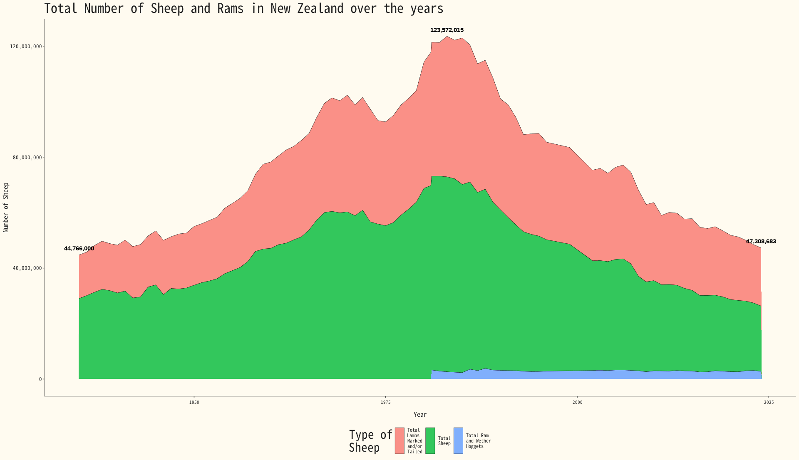

Timeline of Sheep in NZ


#### 1. R code

```{r}
# | echo: true
# | eval: false
# | warning: false
# | message: false

if(!(require(tidyverse))){install.packages("tidyverse"); library(tidyverse)}
if (!requireNamespace("CustomGGPlot2Theme", quietly = TRUE)) {
  devtools::install_local("~/Documents/Documents/Coding/CustomGGPlot2Theme", dependencies = TRUE)
}
library(CustomGGPlot2Theme)

if(!(require(patchwork))){install.packages("patchwork"); library(patchwork)}

options(scipen=999)

dataset <- readr::read_csv('https://raw.githubusercontent.com/rfordatascience/tidytuesday/main/data/2026/2026-02-17/dataset.csv')

sheep <- dataset %>% 
  filter(value_label == "Number of sheep") %>% 
  select(year_ended_june, measure, value) %>% 
  mutate(value = as.integer(value)) %>% 
  filter(str_detect(measure, "Total")) 

peak_year <- sheep %>%
  group_by(year_ended_june) %>%
  summarize(total_val = sum(value)) %>%
  filter(total_val == max(total_val)) %>%
  pull(year_ended_june)

labels_data <- sheep %>%
  group_by(year_ended_june) %>%
  summarize(total_val = sum(value)) %>%
  filter(year_ended_june %in% c(1935, 2024, peak_year))


sheep <- dataset %>% 
  filter(value_label == "Number of sheep") %>% 
  select(year_ended_june, measure, value) %>% 
  mutate(value = as.integer(value)) %>% 
  filter(str_detect(measure, "Total"))  %>% 
  filter(measure != "Total Sheep other than Ewes/Ewe Hoggets put to Ram") |> 
  mutate(measure = str_wrap(measure, width = 20))


gap_plot <- ggplot(sheep, aes(x = year_ended_june, y = value, fill = str_wrap(measure, width = 10))) +
  geom_area(color = "black", linewidth = 0.2, alpha = 0.8) +
  scale_y_continuous(labels = function(x) format(x, big.mark = ",", scientific = FALSE)) +
  labs(
    title = "Total Number of Sheep and Rams in New Zealand over the years",
    x = "Year",
    y = "Number of Sheep",
    fill = str_wrap("Type of Sheep", 10)
  ) +
  geom_text(
    data = labels_data, 
    aes(x = year_ended_june, y = total_val, label = scales::comma(total_val)),
    inherit.aes = FALSE, 
    vjust = -1,          
    size = 4,
    fontface = "bold"
  ) +
  Custom_Style() +
  theme(legend.position = "bottom", text = element_text(size = 15))

```
