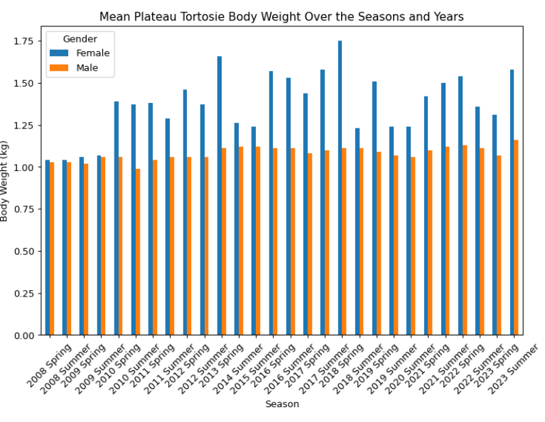

Weights of Tortoises per season per year 


#### 1. Python code

```{python}
# | echo: true
# | eval: false
# | warning: false
# | message: false

import pandas as pd

import numpy as np

import matplotlib.pyplot as plt

clutch_size = pd.read_csv('https://raw.githubusercontent.com/rfordatascience/tidytuesday/main/data/2026/2026-03-03/clutch_size_cleaned.csv')

tortoise_body = pd.read_csv('https://raw.githubusercontent.com/rfordatascience/tidytuesday/main/data/2026/2026-03-03/tortoise_body_condition_cleaned.csv')

list(tortoise_body_condition_cleaned.columns.values)

individual_avg = tortoise_body.groupby(['individual', 'sex', 'year', 'season'])['body_mass_grams'].mean().reset_index()

mean_weight_season = individual_avg.groupby(['sex', 'year', 'season'])['body_mass_grams'].mean().round(2).reset_index()#

mean_weight_season['body_mass_kilograms'] = (mean_weight_season['body_mass_grams'] / 1000).round(2)

mean_weight_season['year_season'] = mean_weight_season['year'].astype(str) + ' ' + mean_weight_season['season']

mean_weight_season['sex'] = np.where(mean_weight_season['sex'] == "f", "Female", "Male")

season_order = {'spring': 1, 'summer': 2}

mean_weight_season['season_order'] = mean_weight_season['season'].str.lower().map(season_order)

mean_weight_season = mean_weight_season.sort_values(['year', 'season_order'])

pivot_data = mean_weight_season.pivot(
  index= 'year_season',
  columns='sex',
  values='body_mass_kilograms'

)

pivot_data.plot(kind='bar', figsize=(10, 6))

plt.title('Mean Plateau Tortosie Body Weight Over the Seasons and Years')

plt.xlabel('Season')

plt.ylabel('Body Weight (kg)')

plt.legend(title='Gender')

plt.xticks(rotation=45)

plt.tight_layout()

plt.show()

```
