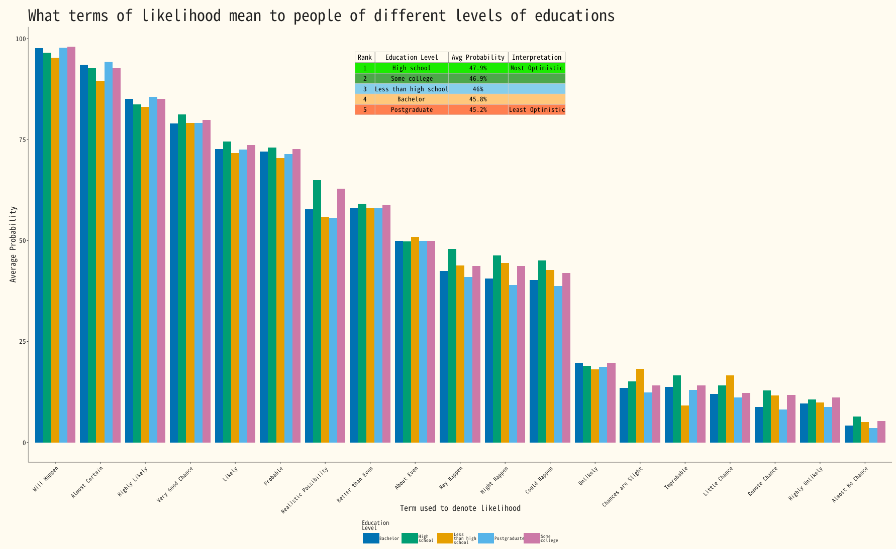

Grouped bar of Education level versus liklihood


#### 1. R code

```{r, data analysis code}
# | echo: true
# | eval: false
# | warning: false
# | message: false

if(!(require(tidyverse))){install.packages("tidyverse"); library(tidyverse)}
if(!(require(gridExtra))){install.packages("gridExtra"); library(gridExtra)}
if(!(require(grid))){install.packages("grid"); library(grid)}
if(!require(CustomGGPlot2Theme)){devtools::install("CustomGGPlot2Theme"); library(CustomGGPlot2Theme)}

options(scipen=999)

absolute_judgements <- readr::read_csv('https://raw.githubusercontent.com/rfordatascience/tidytuesday/main/data/2026/2026-03-10/absolute_judgements.csv')

pairwise_comparisons <- readr::read_csv('https://raw.githubusercontent.com/rfordatascience/tidytuesday/main/data/2026/2026-03-10/pairwise_comparisons.csv')

respondent_metadata <- readr::read_csv('https://raw.githubusercontent.com/rfordatascience/tidytuesday/main/data/2026/2026-03-10/respondent_metadata.csv')

education <- respondent_metadata %>%
  select(response_id, education_level)

df <- absolute_judgements %>%
  left_join(education, by = "response_id") %>%
  filter(!is.na(education_level)) %>%
  group_by(term, education_level) %>%
  summarise(mean = mean(probability)) %>%
  arrange(desc(mean))

optimism_analysis <- df %>%
  group_by(education_level) %>%
  summarise(avg_probability = mean(mean), 
            .groups = "drop") %>%
  arrange(desc(avg_probability)) %>%
  mutate(rank = row_number(),
         interpretation = case_when(
           rank == 1 ~ "Most Optimistic",
           rank == n() ~ "Least Optimistic",
           TRUE ~ ""))


table_data <- optimism_analysis %>%
  mutate(avg_probability = paste0(round(avg_probability, 1), "%")) %>%
  select(Rank = rank,
         `Education Level` = education_level,
         `Avg Probability` = avg_probability,
         Interpretation = interpretation)


term_order <- df %>%
  group_by(term) %>%
  summarise(overall_mean = mean(mean)) %>%
  arrange(desc(overall_mean)) %>%
  pull(term)


df <- df %>%
  mutate(term = factor(term, levels = term_order)) %>%
  arrange(term, desc(mean))


# Plot settings

cb_palette <- c("#0072B2", "#009E73", "#E69F00", "#56B4E9", "#CC79A7")

plot <- ggplot(df, aes(fill=str_wrap(education_level, 10), y=mean, x=term)) +
  geom_bar(position="dodge", stat="identity") + 
  scale_fill_manual(values = cb_palette) +
  labs(y = "Average Probability",
       x = "Term used to denote likelihood",
       fill = "Education\nLevel",
       title = "What terms of likelihood mean to people of different levels of educations") +
  theme(axis.text.x = element_text(angle = 45, hjust = 1)) +
  Custom_Style() +
  theme(
    panel.background = element_blank(),
    legend.position = "bottom",
  
    legend.title = element_text(size = 9, face = "bold"), 
    legend.text = element_text(size = 8),
    plot.background = element_rect(fill = "#FFFBF0", color = NA) 
  ) +
  guides(fill = guide_legend(nrow = 1, byrow = TRUE)) +
  theme(
    legend.key.width = unit(1.2, "cm"), 
    legend.spacing.x = unit(1, "cm"),
    legend.spacing.y = unit(1, "cm"),
    legend.text = element_text(size = 7, margin = margin(r = 10, unit = "pt"))
  ) +
  guides(fill = guide_legend(
    nrow = 1, 
    byrow = TRUE,
    title.position = "top", 
    label.position = "right"
  ))

n_rows <- nrow(table_data)

color_palette <- colorRampPalette(c("#1E4D8B", "#6BA3D0", "#B8D4E8", "#E8F1F7"))(n_rows)

grob_table <- tableGrob(
  table_data,
  rows = NULL,
  theme = ttheme_default(
    core = list(
      bg_params = list(fill = c("#1beb00ff", "#4da74aff", "#87CEEB", "#ffc87c", "#ff7f50")[1:n_rows],
                       col = "grey80"),
      fg_params = list(cex = 0.8, fontfamily = "noto_mono", col = "black")),
    colhead = list(
      bg_params = list(fill = "#FFFBF0", col = "grey40"),
      fg_params = list(cex = 0.9, fontfamily = "noto_mono", fontface = "bold", col = "black"))))


plot <- plot + 
  annotation_custom(
    grob = grob_table, 
    xmin = -Inf, xmax = Inf, 
    ymin = 75, ymax = Inf  
  ) +
  theme(
    plot.background = element_rect(fill = "#FFFBF0", color = NA),
    panel.background = element_blank(), 
    plot.margin = margin(t = 20, r = 20, b = 20, l = 20) 
  )

# print(plot)
```
