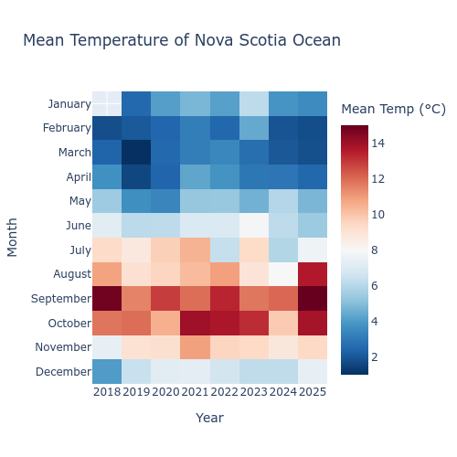

A heatmap of Nova Scotia Ocean Temps over time


#### 1. Python code

```{python, data analysis code}
# | echo: true
# | eval: false
# | warning: false
# | message: false


import pandas as pd
import numpy as np
import plotly.express as px

ocean_temperature = pd.read_csv('https://raw.githubusercontent.com/rfordatascience/tidytuesday/main/data/2026/2026-03-31/ocean_temperature.csv')

ocean_temperature_deployments = pd.read_csv('https://raw.githubusercontent.com/rfordatascience/tidytuesday/main/data/2026/2026-03-31/ocean_temperature_deployments.csv')

df = ocean_temperature

df['date'] = pd.to_datetime(df['date'])

df['month'] = df['date'].dt.strftime('%B')

df['year'] = df['date'].dt.strftime('%Y')

summary = df.groupby(['month', 'year']).agg (mean = ("mean_temperature_degree_c", "mean")).reset_index()

month_order = ['January', 'February', 'March', 'April', 'May', 'June', 'July', 'August', 'September', 'October', 'November', 'December']

summary['month'] = pd.Categorical(summary['month'], categories= month_order, ordered = True)

summary = summary.sort_values(['year', 'month']).reset_index(drop=True)

pivot = summary.pivot(index = "month", columns="year", values='mean' ).round(2)

fig = px.imshow(pivot,
  labels = dict(x = "Year", y = "Month", color="Mean Temp (°C)"),
  color_continuous_scale="RdBu_r",
  aspect="auto",
  text_auto= True,
  title = "Mean Temperature of Nova Scotia Ocean",
  width=500,
  height=500)

fig.show()


```
