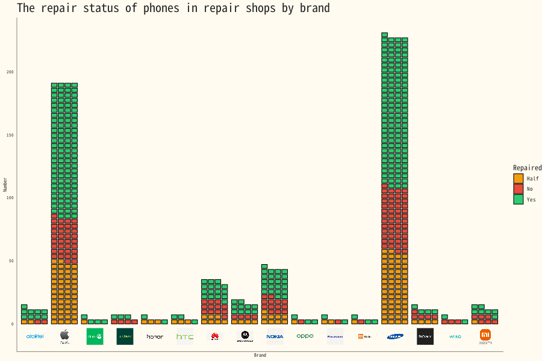

A Brick chart of Phone repairability 


#### 1. R code

```{r, data analysis code}
# | echo: true
# | eval: false
# | warning: false
# | message: false

if(!(require(tidyverse))){install.packages("tidyverse"); library(tidyverse)}
if(!(require(ggbrick))){install.packages("ggbrick"); library(ggbrick)}
if(!(require(ggimage))){install.packages("ggimage"); library(ggimage)}
if(!(require(magick))){install.packages("magick"); library(magick)}
if(!require(CustomGGPlot2Theme)){devtools::install("CustomGGPlot2Theme"); library(CustomGGPlot2Theme)}


options(scipen=999)
repairs <- readr::read_csv('https://raw.githubusercontent.com/rfordatascience/tidytuesday/main/data/2026/2026-04-07/repairs.csv')
repairs_text <- readr::read_csv('https://raw.githubusercontent.com/rfordatascience/tidytuesday/main/data/2026/2026-04-07/repairs_text.csv')


phones <- repairs %>%
  filter(brand != "Unknown/n.a.") %>% 
  filter(category == "Computer equipment / phones")  %>% 
  filter(kind_of_product == "Smartphone" | kind_of_product == "Mobile phone / cell phone (not smartphone)") 


summary <- phones %>% 
  mutate(brand  = case_when(
    brand == "iPhone" ~ "Apple", TRUE ~ brand
  )) %>% 
  group_by( brand, repaired) %>% 
  summarise(n = n(), .groups = "drop"
) %>% 
  group_by(brand) %>% 
  mutate(total = sum(n),
          pct      = n / total * 100, 
           repaired = str_to_title(repaired)) %>% 
  ungroup()  %>% 
  filter(total >= 5) 


file_path <- Sys.getenv("LOGO_PATH")
brands    <- unique(summary$brand)
logos     <- c()

for (i in 1:length(brands)) {
  x        <- brands[i]
  logos[x] <- paste0(file_path, str_to_lower(x), ".png")
}

logo_df <- data.frame(
  brand = names(logos),
  image = unname(logos)
)

summary <- summary %>%
  left_join(logo_df, by = "brand") 


clean_logo <- function(path) {
  image_read(path) %>%
    # Fuzz allows for slight variations in the grey/white shades
    image_fill(color = "transparent", point = "+1+1", fuzz = 20) %>%
    image_trim() # Optional: removes extra empty space around the logo
}
# apply to all
logo_df$image <- sapply(logo_df$image, function(p) {
  img <- clean_logo(p)
  new_path <- paste0(tempdir(), "/", basename(p))
  image_write(img, new_path)
  new_path
})


plot <- summary %>%
  ggplot(aes(x = brand, y = n, fill = repaired)) +
  geom_waffle(
  ) +
  geom_image(
    data  = logo_df,                
    aes(x = brand, y = -10, image = image),  
    size  = 0.05,
    asp = 1,
    inherit.aes = FALSE
  ) +
  scale_fill_manual(values = c(
    "Yes"  = "#2ecc71",
    "Half" = "#f39c12",
    "No"   = "#e74c3c"
  )) +theme_minimal() +
  theme(
    axis.text.x  = element_blank(),   
    axis.ticks.x = element_blank(),
    panel.grid   = element_blank()
  ) +
  labs(
    fill = "Repaired",
    x    = "Brand",
    y    = "Number",
    title = str_wrap("The repair status of phones in repair shops by brand")
  ) +
    Custom_Style() +
    theme(
      legend.position = "right",
      legend.title = element_text(size = 9),
      legend.text = element_text(size = 7),
      axis.text.x = element_blank(),
      axis.title.x = element_text(size = 6),
      axis.title.y =element_text(size =6),
      axis.text.y = element_text(size =5),
      plot.title =  element_text(size = 15)
    )


```
