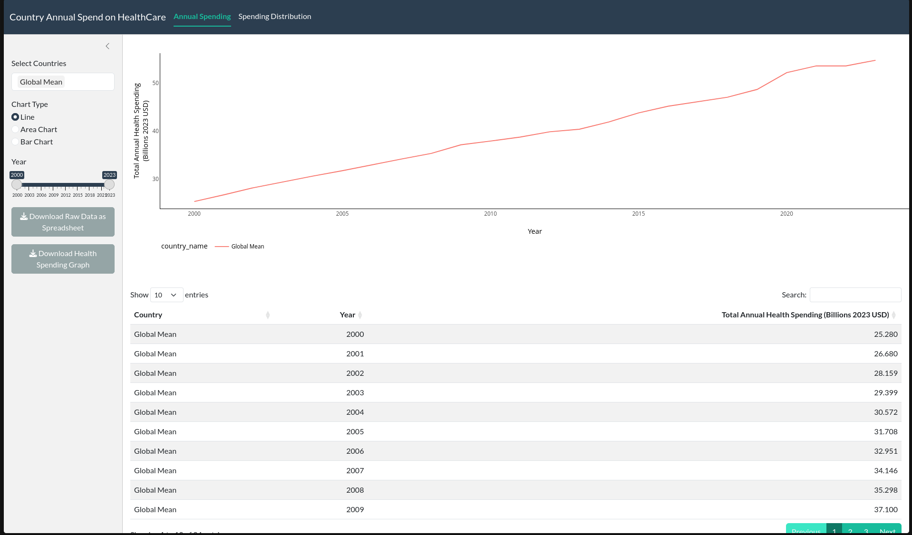

An image of my Shiny App


#### 1. R code

```{r, data analysis code}
# | echo: true
# | eval: false
# | warning: false
# | message: false

if(!(require(tidyverse))){install.packages("tidyverse"); library(tidyverse)}
if(!(require(shiny))){install.packages("shiny"); library(shiny)}
if(!(require(bslib))){install.packages("bslib"); library(bslib)}
if(!(require(DT))){install.packages("DT"); library(DT)}
if(!(require(plotly))){install.packages("plotly"); library(plotly)}
if(!(require(openxlsx))){install.packages("openxlsx"); library(openxlsx)}

options(scipen=999999)


health_spending <- readr::read_csv('https://raw.githubusercontent.com/rfordatascience/tidytuesday/main/data/2026/2026-04-21/health_spending.csv') %>% 
    filter(unit == "constant 2023 US$", indicator_code == "che_usd2023")  
spending_purpose <- readr::read_csv('https://raw.githubusercontent.com/rfordatascience/tidytuesday/main/data/2026/2026-04-21/spending_purpose.csv') %>% 
    filter(unit == "% of current health expenditure")


countries <- sort(unique(health_spending$country_name))


global_mean_data <- health_spending %>%
    group_by(year) %>%
    summarise(value = mean(value, na.rm = TRUE) / 10^9, .groups = "drop") %>%
    mutate(country_name = "Global Mean")

min_year <- min(health_spending$year)
max_year <- max(health_spending$year)


ui <- page_navbar(
    title = "Country Annual Spend on HealthCare",
    theme = bs_theme(bootswatch = "flatly"),
    
    nav_panel(
        title = "Annual Spending",
        layout_sidebar(
            sidebar = sidebar(
                selectInput(
                    inputId  = "selected_countries",
                    label    = "Select Countries",
                    choices  = c("Global Mean", countries),
                    selected = "Global Mean",
                    multiple = TRUE
                ),
                radioButtons(
                    inputId  = "chart_type",
                    label    = "Chart Type",
                    choices  = c("Line", "Area Chart", "Bar Chart"),
                    selected = "Line"
                ),
                sliderInput(
                    inputId = "year_range",
                    label   = "Year",
                    min     = as.numeric(min_year),
                    max     = as.numeric(max_year),
                    value   = c(min_year, max_year),
                    step    = 1,
                    sep     = ""
                ),
                downloadButton("downloadxlsx", "Download Raw Data as Spreadsheet"),
                downloadButton("downloadgraph", "Download Health Spending Graph")
            ),
            
            fluidRow(plotlyOutput("plot", height = "500px")),
            fluidRow(DT::dataTableOutput("table"))
        )
    ),
    
    nav_panel(
        title = "Spending Distribution",
        layout_sidebar(
            sidebar = sidebar(       
                selectInput(
                    inputId  = "selected_countries_2",
                    label    = "Select Country",
                    choices  = countries,
                    selected = "United States of America",
                    multiple = FALSE
                ),
                sliderInput(
                    inputId = "year_range_2",
                    label   = "Year",
                    min     = as.numeric(min_year),
                    max     = as.numeric(max_year),
                    value   = c(min_year, max_year),
                    step    = 1,
                    sep     = ""
                ),
                downloadButton("downloadgraph2", "Download Spending Distribution Graph")
            ),                         
            fluidRow(
                plotlyOutput("plot2", height = "600px")
            )
        )                            
    )       
)

server <- function(input, output) {
    
    # --- Page 1 ---
    filtered_data <- reactive({
        country_data <- health_spending %>%
            filter(
                country_name %in% input$selected_countries,
                year >= input$year_range[1],
                year <= input$year_range[2]
            ) %>%
            group_by(country_name, year) %>%
            summarise(value = round(sum(value, na.rm = TRUE) / 10^9, digits = 3), .groups = "drop")
        
        if ("Global Mean" %in% input$selected_countries) {
            country_data <- bind_rows(
                country_data,
                global_mean_data %>% filter(
                    year >= input$year_range[1],
                    year <= input$year_range[2]
                )
            )
        }
        country_data
    })
    
    base_plot <- reactive({
        p <- ggplot(data = filtered_data(), aes(
            x     = year,
            y     = value,
            color = country_name,
            fill  = country_name
        )) +
            scale_y_continuous(labels = scales::comma)
        
        if (input$chart_type == "Line") {
            p <- p + geom_line(linewidth = 0.5)
        } else if (input$chart_type == "Area Chart") {
            p <- p + geom_area(alpha = 0.6, position = "identity")
        } else {
            p <- p %+% aes(x = factor(year)) +
                geom_col(position = "dodge")
        }
        
        p + theme_minimal() +
            labs(
                y = str_wrap("Total Annual Health Spending (Billions 2023 USD)", 30),
                x = "Year"
            ) +
            theme(panel.grid = element_blank(), axis.line = element_line())
    })
    
    output$plot <- renderPlotly({
        ggplotly(base_plot()) %>%
            layout(
                hovermode = "x unified",
                legend    = list(orientation = "h", x = 0, y = -0.2, entrywidth = 150),
                yaxis     = list(tickformat = ",.1f"),
                margin    = list(b = 150)
            )
    })
    
    output$table <- DT::renderDataTable(
        DT::datatable(
            filtered_data(),
            colnames = c(
                "Country"                                    = "country_name",
                "Year"                                       = "year",
                "Total Annual Health Spending (Billions 2023 USD)" = "value"
            ),
            options  = list(pageLength = 10),
            rownames = FALSE
        ) %>%
            DT::formatRound(
                columns = "Total Annual Health Spending (Billions 2023 USD)",
                digits  = 3
            )
    )
    
    output$downloadxlsx <- downloadHandler(
        filename = function() { paste0("health_spending_", Sys.Date(), ".xlsx") },
        content  = function(file) {
            openxlsx::write.xlsx(
                filtered_data() %>% rename(
                    "Country" = country_name,
                    "Year"    = year,
                    "Total Annual Health Spending (Billions 2023 USD)" = value
                ), file
            )
        }
    )
    
    output$downloadgraph <- downloadHandler(
        filename = function() {
            foo <- switch(input$chart_type,
                          "Line"       = "line",
                          "Area Chart" = "area",
                          "Bar Chart"  = "bar"
            )
            paste0("health_spending_", foo, "_graph_", Sys.Date(), ".png")
        },
        content = function(file) {
            ggsave(file, plot = base_plot(), width = 10, height = 6, dpi = 150)
        }
    )
    
    # --- Page 2 ---
    filtered_data_2 <- reactive({
        spending_purpose %>%
            filter(
                country_name == input$selected_countries_2,
                year >= input$year_range_2[1],
                year <= input$year_range_2[2]
            ) %>%
            group_by(spending_purpose) %>%
            summarise(value = mean(value, na.rm = TRUE), .groups = "drop")
    })
    
    base_plot_2 <- reactive({
        ggplot(filtered_data_2(), aes(
            x    = "",
            y    = value,
            fill = spending_purpose
        )) +
            geom_col(width = 1) +
            coord_polar(theta = "y") +
            theme_void() +
            labs(
                title = paste0("Health Spending Distribution — ", input$selected_countries_2),
                fill  = "Spending Purpose"
            )
    })
    
    output$plot2 <- renderPlotly({
        plot_ly(
            filtered_data_2(),
            type          = "sunburst",
            labels        = ~spending_purpose,
            values        = ~value,
            parents       = ~"",
            textinfo      = "label+percent entry",
            hovertemplate = paste0(
                "<b>%{label}</b><br>",
                "Share: %{value:.1f}%<br>",
                "<extra></extra>"
            )
        ) %>%
            layout(
                title  = paste0("Health Spending Distribution — ", input$selected_countries_2),
                margin = list(t = 60)
            )
    })
    
    output$downloadgraph2 <- downloadHandler(
        filename = function() {
            paste0("spending_distribution_", input$selected_countries_2, "_", Sys.Date(), ".png")
        },
        content = function(file) {
            ggsave(file, plot = base_plot_2(), width = 10, height = 6, dpi = 150)
        }
    )
    
    
}

# shinyApp(ui, server)


```
