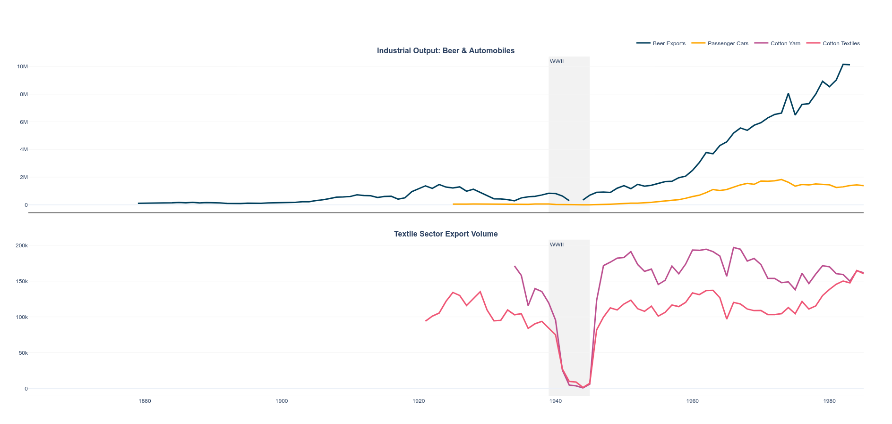

A graph of Cars versus Beer and Textiles


#### 1. Python code

```{python, data analysis code}
# | echo: true
# | eval: false
# | warning: false
# | message: false

import pandas as pd
import plotly.graph_objects as go
from plotly.subplots import make_subplots

food_beverages = pd.read_csv('https://raw.githubusercontent.com/rfordatascience/tidytuesday/main/data/2026/2026-05-05/food_beverages.csv')
textiles = pd.read_csv('https://raw.githubusercontent.com/rfordatascience/tidytuesday/main/data/2026/2026-05-05/textiles.csv')
transport = pd.read_csv('https://raw.githubusercontent.com/rfordatascience/tidytuesday/main/data/2026/2026-05-05/transport.csv')

master = food_beverages[['Year', 'Beer']].merge(
    transport[["Year", "Passenger_cars"]], on='Year', how='left'
).rename(columns={'Beer': 'Beer Exports', 'Passenger_cars': 'Passenger Cars'})

cotton_data = textiles[['Year', 'Cotton_textiles', 'Cotton_yarn']].rename(
    columns={'Cotton_yarn': 'Cotton Yarn', 'Cotton_textiles': 'Cotton Textiles'}
)

fig = make_subplots(
    rows=2, cols=1, 
    shared_xaxes=True, 
    vertical_spacing=0.08,
    subplot_titles=("<b>Industrial Output: Beer & Automobiles</b>", "<b>Textile Sector Export Volume</b>")
)

fig.add_trace(
    go.Scatter(x=master['Year'], y=master['Beer Exports'], name="Beer Exports", line=dict(color='#003f5c', width=3)),
    row=1, col=1
)
fig.add_trace(
    go.Scatter(x=master['Year'], y=master['Passenger Cars'], name="Passenger Cars", line=dict(color='#ffa600', width=3)),
    row=1, col=1
)

fig.add_trace(
    go.Scatter(x=cotton_data['Year'], y=cotton_data['Cotton Yarn'], name="Cotton Yarn", line=dict(color='#bc5090', width=3)),
    row=2, col=1
)
fig.add_trace(
    go.Scatter(x=cotton_data['Year'], y=cotton_data['Cotton Textiles'], name="Cotton Textiles", line=dict(color='#ef5675', width=3)),
    row=2, col=1
)

fig.add_vrect(
    x0=1939, x1=1945, 
    fillcolor="gray", opacity=0.1, 
    layer="below", line_width=0, 
    row="all", col=1,
    annotation_text="WWII", annotation_position="top left"
)

fig.update_layout(
    template="plotly_white",
    height=900,
    font_family="Arial",
    hovermode="x unified",
    legend=dict(
        orientation="h",
        yanchor="bottom",
        y=1.02,
        xanchor="right",
        x=1
    ),
    margin=dict(t=120, l=60, r=60, b=60)
)

fig.update_xaxes(showgrid=False, linecolor='black')
fig.update_yaxes(gridcolor='whitesmoke', nticks=10)

fig.show()
```
